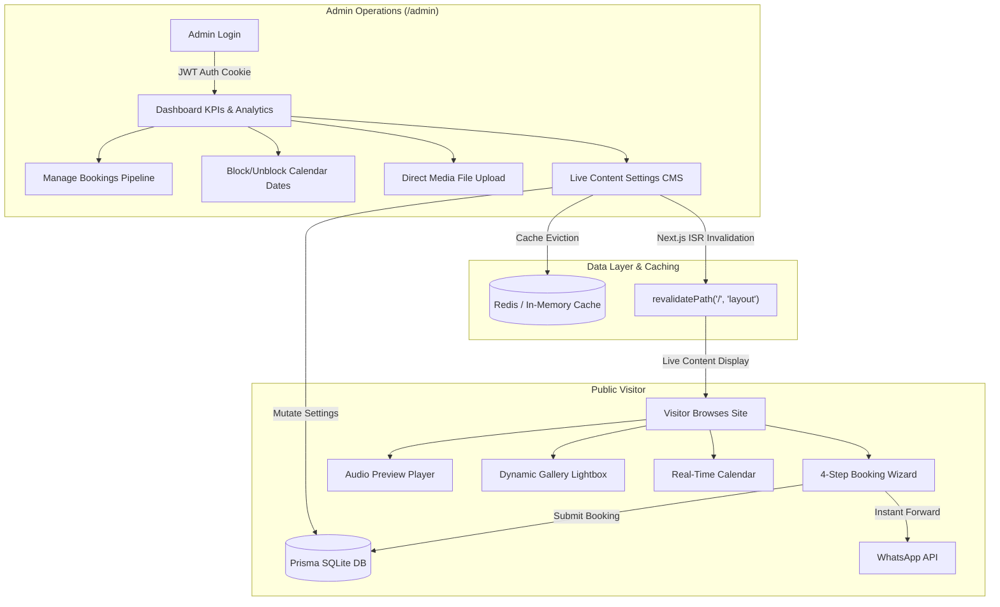

<div align="center">

# 🎧 DJ MANTU — EVENT SOUND & ENTERTAINMENT PLATFORM

### _Turn Every Moment Into An Unforgettable Memory_

[](https://nextjs.org/)
[](https://react.dev/)
[](https://tailwindcss.com/)
[](https://www.prisma.io/)
[](https://www.typescriptlang.org/)
[](https://www.sqlite.org/)
[](LICENSE)

<p align="center">
  <b>A production-ready, full-stack booking platform and management suite built for DJ Mantu — Western Odisha's premier open-format DJ, sound engineer, and arena-grade event producer.</b>
</p>

<p align="center">
  <a href="#-executive-overview">Overview</a> •
  <a href="#-key-features">Key Features</a> •
  <a href="#-architecture--data-flow">Architecture</a> •
  <a href="#-tech-stack">Tech Stack</a> •
  <a href="#-project-structure">Project Structure</a> •
  <a href="#-quick-start">Quick Start</a> •
  <a href="#-admin-portal">Admin Portal</a> •
  <a href="#-api-endpoints-overview">API Reference</a> •
  <a href="#-contact--booking">Contact</a>
</p>

---

</div>

## 🌟 Executive Overview

**DJ Mantu Event Booking Platform** is an enterprise-grade digital portal engineered to streamline the booking and management of weddings, grand receptions, sangeets, college festivals, corporate galas, and VIP celebrations.

Powered by **Next.js 16 (App Router)**, **React 19**, and **Tailwind CSS v4**, this application marries modern glassmorphism aesthetics with mission-critical features:

- **Instant Client Onboarding**: 4-step wizard with consultation preferences and direct WhatsApp & Call lead generation.
- **Real-Time Date Availability Engine**: Visual booking calendar with instant conflict prevention.
- **Edge-to-Edge Lightbox Media Suite**: Unified gallery supporting high-res photos and video embeds with zero letterboxing.
- **Executive Administration Suite (`/admin`)**: Analytics, booking status pipeline, calendar blocking, direct media uploads, and live website CMS with automatic ISR cache invalidation.

---

## ✨ Key Features

### 🌐 Public Client Experience

- **⚡ Multi-Step Interactive Booking Wizard (`/book`)**:
  - Step 1: Event type, date, time slot, venue city, and guest count.
  - Step 2: Tiered sound & lighting package selection (Club, Wedding, Arena).
  - Step 3: SFX add-ons (Dry Ice Cloud Fog, Cold Pyro Sparkulars, DMX Truss lighting).
  - Step 4: Customer verification, celebration scale / discussion preferences, celebratory confetti, and one-click WhatsApp forwarding with pre-formatted event specs.

- **💬 Direct WhatsApp & Call Consultation Model**:
  - Transparent tailored inquiries: Replaced static public price tags with direct **WhatsApp for Details** and **Call for Details** action buttons across every package card and service item.
  - Pre-filled WhatsApp chat messages with exact package or service titles for seamless client conversion.

- **🎧 Comprehensive Event Services Catalog (`/services`)**:
  - **Royal Wedding & Baraat DJ**: Laptop setup for baraats, grand entry music for bride and groom, and regional festive hits (Sambalpuri, Chhattisgarhi, Nagpuri, Odia, Punjabi & Bollywood).
  - **Private Party**: High-energy sound, ambient party lighting, and custom playlists for birthdays, anniversaries, and farmhouse celebrations.
  - **College Cultural Fests**: Festival-scale line array audio, high-power multi-beam lasers, and campus crowd EDM fests.
  - **Wedding Reception Gala**: Sophisticated dinner melodies transitioning smoothly into explosive family dance beats.
  - **Dry Ice Low Fog & Cold Pyro Sparks**: Fairy-tale cloud entries and indoor-safe cold sparkular pyrotechnics.

- **📅 Real-Time Availability Calendar (`/availability`)**:
  - Interactive monthly calendar showing **Available**, **Booked**, **Pending**, and **Blocked** dates.
  - Real-time conflict protection preventing double bookings on the same date.
  - One-click date selection that directly prefills the booking wizard.

- **🖼️ Unified Visual & Video Gallery (`/gallery`)**:
  - Filter items by category (_Weddings, Receptions, Parties, Birthdays, Corporate_).
  - **Zero-Blank-Space Lightbox**: Photos fit the frame edge-to-edge with no dark letterbox voids.
  - **Dual Display Modes**: Toggle between **Fill Frame (Full Widescreen)** and **Fit Photo (Snug uncropped frame)**.
  - **Ambient Glow Backdrop**: Soft, color-matching blurred ambient reflection behind images for an ultra-premium visual feel.
  - **Embedded Video Player**: Smooth playback for YouTube URLs and direct uploaded MP4 videos.
  - **Hover-Based Asset Prefetching**: High-resolution assets prefetch into browser memory on thumbnail hover for instantaneous lightbox opening.

- **🎵 Integrated Audio Preview Player**:
  - Floating music player with live waveforms demonstrating DJ Mantu's signature Bollywood Dance Music (BDM), Punjabi EDM, and Commercial House sets.

- **💬 Floating WhatsApp Concierge**:
  - Animated, responsive WhatsApp CTA widget allowing instant customer communication from any page on the site.

- **🎨 Modern Cyberpunk / Obsidian Aesthetics**:
  - Deep obsidian backgrounds (`#08080C`), electric violet accents, hot pink gradients, and frosted glass cards (`glass-panel`).
  - Mobile-first, fully responsive design with fluid touch navigation and smooth micro-animations.

---

### 🛡️ Executive Administration Suite (`/admin`)

- **📊 Real-Time Analytics Dashboard**:
  - Key Performance Indicators: Total Bookings, Confirmed Revenue, Pending Inquiries, and Conversion Rates.
  - Live activity feed showing recent booking requests with instant action buttons.

- **📑 Full Booking Lifecycle Pipeline (`/admin/bookings`)**:
  - Track booking statuses: `PENDING` ➔ `CONTACTED` ➔ `CONFIRMED` ➔ `COMPLETED` ➔ `CANCELLED`.
  - Filter bookings by status, search by customer phone or booking reference code (`DJ-YYYY-XXX`).
  - View comprehensive event details, venue address, client notes, and selected package add-ons.

- **📆 Interactive Calendar Blocking (`/admin/calendar`)**:
  - Visual monthly calendar management.
  - One-click manual date blocking for private bookings, personal leave, or equipment maintenance.

- **📁 Direct Media Upload & Gallery CMS (`/admin/gallery`)**:
  - Direct multipart file uploads (`/api/admin/upload`) saved to disk with timestamped filenames.
  - Add, edit, reorder, or feature photos and video performances without touching code.

- **⚙️ Live Website Content Sync (`/admin/settings`)**:
  - Dynamically update Hero Headline, Subtitle, Brand Tagline, Bio, Address, Phone, WhatsApp, and Service Areas.
  - **Instant Next.js ISR Route Invalidation (`revalidatePath`)**: Edits immediately reflect on the live public site without server restarts or rebuilds.
  - Automatic cache clearing for Redis and memory layers.

- **📦 Package & Service Catalog Management (`/admin/packages`, `/admin/services`)**:
  - Update configurations, duration, equipment lists, and features for all sound packages and specialized event services.

---

## 🏗️ Architecture & Data Flow



---

## 💻 Tech Stack

| Category           | Technology                                                                                            | Version / Details                                                |
| :----------------- | :---------------------------------------------------------------------------------------------------- | :--------------------------------------------------------------- |
| **Framework**      | [Next.js](https://nextjs.org/)                                                                        | `16.3.4` (App Router, Server Actions, Route Handlers)            |
| **UI Library**     | [React](https://react.dev/)                                                                           | `19.2.8`                                                         |
| **Styling**        | [Tailwind CSS](https://tailwindcss.com/)                                                              | `v4.0` with PostCSS plugin & CSS variables                       |
| **Icons & SFX**    | [Lucide React](https://lucide.dev/), [Canvas Confetti](https://www.npmjs.com/package/canvas-confetti) | Dynamic vector icons and celebratory animations                  |
| **Database & ORM** | [Prisma ORM](https://www.prisma.io/)                                                                  | `6.19.3` with SQLite (Zero-config local setup, PostgreSQL ready) |
| **Caching Layer**  | [ioredis](https://github.com/redis/ioredis)                                                           | Redis caching with seamless in-memory fallback                   |
| **Authentication** | [Jose](https://github.com/panva/jose), [Bcryptjs](https://github.com/dcodeIO/bcrypt.js)               | Secure HTTP-only JWT cookies & password hashing                  |
| **Language**       | [TypeScript](https://www.typescriptlang.org/)                                                         | `5.0` (Strict typing)                                            |

---

## 📁 Project Structure

```
Mantu-DJ-Booking/
├── prisma/
│   ├── dev.db                 # SQLite database storage
│   ├── schema.prisma          # Database models (Admin, Booking, Customer, Availability, Package, Service, Gallery, Settings)
│   └── seed.ts                # Database seed script with production-ready content
├── public/
│   ├── audio/                 # Audio previews & DJ mix tracks
│   ├── images/                # Brand imagery, avatar & logos
│   └── uploads/               # User-uploaded gallery photos & video files
├── src/
│   ├── app/
│   │   ├── (public)/          # Public routes with shared navigation layout
│   │   │   ├── about/         # Artist biography, gear specs & experience
│   │   │   ├── availability/  # Real-time event date availability calendar
│   │   │   ├── book/          # Interactive multi-step booking wizard
│   │   │   ├── contact/       # Contact card, address & direct WhatsApp link
│   │   │   ├── gallery/       # Unified visual gallery & video showcase
│   │   │   ├── packages/      # Sound & lighting package tiers
│   │   │   ├── services/      # Individual event services & SFX add-ons
│   │   │   ├── layout.tsx     # Public layout (Navbar, Floating WhatsApp, Footer)
│   │   │   └── page.tsx       # Dynamic homepage with live CMS settings
│   │   ├── admin/             # Executive admin portal
│   │   │   ├── (dashboard)/   # Authenticated dashboard views
│   │   │   │   ├── bookings/  # Booking lifecycle pipeline & search
│   │   │   │   ├── calendar/  # Date blocking & scheduling view
│   │   │   │   ├── customers/ # Customer directory
│   │   │   │   ├── gallery/   # Direct media uploads & gallery CMS
│   │   │   │   ├── packages/  # Package configurations & equipment manager
│   │   │   │   ├── services/  # Service catalog manager
│   │   │   │   ├── settings/  # Live website copy & contact settings
│   │   │   │   └── page.tsx   # Dashboard overview with KPIs & analytics
│   │   │   └── login/         # Secure JWT login screen
│   │   └── api/               # API route handlers
│   │       ├── admin/         # Protected endpoints (bookings, calendar, gallery, packages, services, settings, upload, cache)
│   │       ├── availability/  # Date check endpoint (/api/availability/check)
│   │       └── bookings/      # Public booking inquiry submission
│   ├── components/            # Reusable UI components
│   │   ├── admin/             # Admin data tables, uploaders & modal forms
│   │   ├── AudioPreviewPlayer # Floating music sampler with waveforms
│   │   ├── AvailabilityChecker# Interactive date calendar
│   │   ├── BookingWizard      # 4-step animated booking wizard
│   │   ├── FloatingWhatsApp   # Direct conversion WhatsApp floating CTA
│   │   ├── Footer             # High-impact footer with service area badges
│   │   ├── GalleryLightbox    # Zero-blank-space photo & video lightbox
│   │   ├── Navbar             # Responsive backdrop-blur navigation
│   │   ├── PackageCard        # Tiered package cards with feature lists
│   │   └── SocialIcons        # Social media vector links
│   └── lib/                   # Database client, auth utilities, cache layers
├── .env.example               # Environment variables template
├── next.config.ts             # Next.js configuration
├── package.json               # Dependencies & scripts
├── README.md                  # Project documentation
└── tsconfig.json              # TypeScript configuration
```

---

## 🚀 Quick Start

### 1. Prerequisites

- **Node.js**: `v20.x` or higher
- **npm**: `v10.x` or higher

### 2. Clone the Repository

```bash
git clone https://github.com/Gautamgiri798/Mantu-DJ-Booking.git
cd Mantu-DJ-Booking
```

### 3. Install Dependencies

```bash
npm install
```

### 4. Setup Environment Variables

Copy the `.env.example` file to `.env`:

```bash
cp .env.example .env
```

Default `.env` configuration:

```env
DATABASE_URL="file:./dev.db"
JWT_SECRET="dj-mantu-ultra-secure-session-key-2026-event-booking"
NEXT_PUBLIC_SITE_URL="http://localhost:3000"
REDIS_URL="redis://127.0.0.1:6379"
```

_(Note: If Redis is not running locally, the application automatically uses an in-memory cache)._

### 5. Setup Database & Seed Initial Content

Generate the Prisma Client and seed the database with initial settings, sound packages, services, and default admin credentials:

```bash
npx prisma generate
npm run db:seed
```

### 6. Start the Development Server

```bash
npm run dev
```

Open [http://localhost:3000](http://localhost:3000) in your browser.

---

## 🔐 Admin Portal

Access the administration suite at:

```
http://localhost:3000/admin
```

### Default Credentials:

- **Email**: `admin@djmantu.com`
- **Password**: `admin123`

> ⚠️ _Important: Remember to change the administrator password and update the `JWT_SECRET` prior to deploying to production._

---

## 📡 API Endpoints Overview

| Method         | Endpoint                  | Description                               | Access |
| :------------- | :------------------------ | :---------------------------------------- | :----- |
| `GET`          | `/api/bookings`           | Fetch availability data & bookings        | Public |
| `POST`         | `/api/bookings`           | Submit a new event booking inquiry        | Public |
| `GET`          | `/api/availability/check` | Real-time date availability query         | Public |
| `POST`         | `/api/admin/login`        | Authenticate admin and set JWT cookie     | Public |
| `POST`         | `/api/admin/logout`       | Clear authentication session              | Admin  |
| `GET` / `POST` | `/api/admin/settings`     | Retrieve or update live website settings  | Admin  |
| `GET` / `POST` | `/api/admin/gallery`      | Retrieve or create gallery items          | Admin  |
| `POST`         | `/api/admin/upload`       | Direct multipart photo/video media upload | Admin  |
| `GET` / `POST` | `/api/admin/packages`     | Manage packages & equipment specs         | Admin  |
| `GET` / `POST` | `/api/admin/services`     | Manage services & equipment catalog       | Admin  |
| `GET` / `POST` | `/api/admin/calendar`     | Manage calendar bookings & date blocks    | Admin  |
| `POST`         | `/api/admin/cache`        | Purge Redis / memory caches on demand     | Admin  |

---

## 🚢 Production Deployment

### Deploying to Vercel

1. Push your latest code to your GitHub repository.
2. Import the project into [Vercel](https://vercel.com/new).
3. Configure environment variables in the Vercel Dashboard (`JWT_SECRET`, `NEXT_PUBLIC_SITE_URL`, etc.).
4. For persistent storage in production:
   - Connect a cloud database (e.g. Supabase, Neon PostgreSQL, or PlanetScale) and update the datasource provider in `prisma/schema.prisma`.
   - Run Prisma migrations:
     ```bash
     npx prisma migrate deploy
     ```

---

## 📍 Contact & Booking Information

<div align="center">

### DJ MANTU

**Western Odisha's Premier Sound & Event Specialist**

📍 **Headquarters**: Brajrajnagar, Jharsuguda, Odisha, Pin - 768216  
📞 **Phone**: [+91 6372174006](tel:+916372174006)  
💬 **WhatsApp**: [+91 6372174006](https://wa.me/916372174006)  
🌐 **Service Areas**: Jharsuguda, Brajrajnagar, Sambalpur, Rourkela, Sundargarh, Bhubaneswar, Cuttack & across Odisha

</div>

---

## 📄 License

This project is licensed under the **MIT License** — see the [LICENSE](LICENSE) file for details.

<div align="center">
  <sub>Crafted with passion, bass, and precision for <b>DJ Mantu</b>.</sub>
</div>
